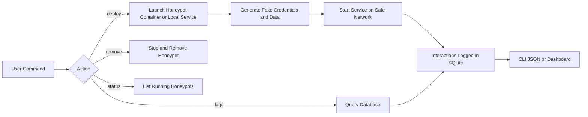

# deception-honeypot-manager

[](https://www.python.org/)
[](#ci-and-platform-coverage)
[](https://docker-py.readthedocs.io/)
[](https://www.sqlite.org/)
[](https://haveibeenpwned.com/API/v2)
[](./LICENSE)

`deception-honeypot-manager` is a Python CLI for deploying, isolating, and monitoring deception services across a lab or segmented network. It ships with built-in SSH, HTTP, and MySQL honeypots, supports Docker-managed deployments, and can ingest stdout from external honeypot projects such as Conpot or the OWASP Python-Honeypot.

## Overview

The project is built for defenders who want fast honeypot deployment without accidentally exposing real data or giving containers unrestricted network access.

- Built-in honeypot templates: `ssh`, `http`, `mysql`
- Optional external integrations: `ics` template for Conpot or any command or image you supply
- Central event store: SQLite database at `data/honeypot.db`
- Alerting: repeated authentication failures and connection floods
- Optional dashboard: Flask web UI for status, logs, and alerts
- Optional HIBP configuration checks: safe by default and disabled unless explicitly enabled

## Why Use This Tool

Use this project when you need a small, auditable deception control plane rather than a collection of one-off scripts.

- Use it to stand up decoy services quickly during purple-team labs, internal detection engineering exercises, or research environments.
- Use it to keep fake credentials, fake service banners, and fake datasets consistent across multiple honeypots.
- Use it to centralize telemetry from local runtimes and external honeypot projects into one SQLite-backed log source.
- Use it to reduce operator error: the default bind address is localhost, Docker mode uses an internal bridge, and optional integrations stay disabled unless you opt in.

## How The Tool Is Used

The operator workflow is intentionally simple:

1. Choose a honeypot type such as `ssh`, `http`, `mysql`, or `ics`.
2. Deploy it either as a local Python service or a Docker-managed container.
3. Let the manager generate fake credentials and fake service data automatically.
4. Query status, logs, and alerts from one place.
5. Remove the instance cleanly when the exercise ends.

When to use each command:

- `deploy`: starts a new honeypot instance and persists its metadata.
- `status`: checks whether deployed instances are still running.
- `logs`: returns recent interaction events as JSON for quick triage or pipeline ingestion.
- `alerts`: summarizes suspicious patterns such as repeated authentication failures.
- `templates`: shows what honeypots are available and how they are intended to be used.
- `inspect`: shows fake credentials, fake data context, and recent activity for one instance.
- `metrics`: summarizes events, alerts, and top source IPs for one honeypot or the full fleet.
- `doctor`: validates local configuration and optional provider readiness.
- `remove`: stops and unregisters an instance safely.

## What The Tool Actually Does

At a practical level, the manager gives you a single control plane for deception services.

- It creates honeypot instances from known templates instead of making you hand-build every decoy.
- It generates synthetic credentials and decoy data automatically so you do not need to invent fake users, banners, or records manually.
- It starts the honeypot either as a local Python process or as a Docker-managed container.
- It records lifecycle state, interaction logs, and alerts in one SQLite database.
- It helps you inspect the current fleet through CLI commands and the optional dashboard.
- It provides a clean way to remove instances without leaving orphaned processes or containers behind.

That makes it useful for defenders who want repeatable deception setups rather than ad hoc scripts.

## Why This Is Helpful

This tool is most helpful when you care about speed, consistency, and safe defaults.

- Speed: you can go from “I need an SSH decoy” to a running instance with one command.
- Consistency: every honeypot has a stored name, port, driver, credentials, fake data profile, and runtime metadata.
- Visibility: all interaction events end up in one place instead of being scattered across stdout, random text files, or separate services.
- Safer experimentation: the defaults bias toward localhost binding, internal Docker networks, fake credentials, and low-risk synthetic content.
- Easier operations: `inspect`, `metrics`, `alerts`, and `logs` make it easier to answer “what is happening right now?” quickly.
- Easier growth: you can start with the built-in honeypots and later integrate external ones like Conpot without throwing away the management layer.

## Under The Hood

When you run the tool, these pieces work together:

1. The CLI in `main.py` parses the command and loads environment-backed settings.
2. The deployer validates the request, checks the name and port, and chooses the correct template.
3. The configurator generates fake credentials and synthetic service data for that honeypot type.
4. The deployer launches the honeypot either as:
   - a local Python process, or
   - a Docker container attached to the internal honeypot network
5. The runtime honeypot records events directly into SQLite, or an external tool writes stdout that the monitor later ingests.
6. The logger evaluates alert rules whenever new events are recorded.
7. The CLI or dashboard reads the SQLite store to render status, logs, metrics, and alerts.

This split keeps the system simple:

- deployment logic is separate from fake-data generation
- event storage is separate from protocol handling
- the dashboard is just another consumer of the same central event store

## Module Walkthrough

These are the main code paths and why they exist:

| File | Responsibility |
| --- | --- |
| `main.py` | CLI entrypoint, command routing, rendering, and top-level wiring |
| `manager/configurator.py` | Generates synthetic usernames, passwords, and fake service data |
| `manager/deployer.py` | Deploys, inspects, removes, and validates honeypot instances |
| `manager/logger.py` | Owns the SQLite schema, event storage, alerting, and metrics summaries |
| `manager/monitor.py` | Ingests stdout-based logs from external honeypot processes |
| `manager/templates.py` | Declares supported honeypot templates and their deployment characteristics |
| `manager/runtime/*.py` | Built-in honeypot implementations for SSH, HTTP, and MySQL |
| `dashboard/app.py` | Optional web UI and JSON API layer over the SQLite store |
| `scripts/bootstrap_kali.sh` | Kali/Linux bootstrap and dependency setup |

## What Happens For Each Main Command

### `deploy`

`deploy` is the command that does the most work.

It:

- resolves the requested template
- validates the honeypot name
- validates the port number
- checks whether the requested port is already busy
- generates fake credentials and fake content
- writes the generated profile to `data/configs/`
- starts the honeypot as a local process or Docker container
- records the instance in SQLite so later commands can manage it

### `status`

`status` refreshes the runtime view of deployed honeypots.

It:

- syncs any external stdout logs first
- checks whether local processes are still alive
- checks Docker container status when Docker is used
- returns the current status plus alert counts

### `logs`

`logs` is the main event retrieval surface.

It:

- queries SQLite for recent interaction events
- optionally filters by honeypot, event type, source IP, or recent time window
- returns JSON or NDJSON so it can feed shell pipelines or other tools

### `alerts`

`alerts` is the higher-signal view of suspicious patterns.

It:

- returns alert records that were generated from underlying event activity
- helps the operator focus on repeated bad behavior instead of reading every event one by one

### `inspect`

`inspect` is the fastest way to understand one specific honeypot instance.

It returns:

- current runtime status
- bind address and port
- fake username and password
- recent alerts
- recent events

### `metrics`

`metrics` is the fleet summary command.

It returns:

- total event count
- total alert count
- event-type distribution
- alert severity distribution
- active honeypot count
- top source IPs
- the latest event seen in scope

### `remove`

`remove` cleans up the instance.

It:

- stops and removes the Docker container, or
- terminates the local process
- marks the honeypot as removed in SQLite

## What Fake Data Gets Generated

Each built-in honeypot gets a different decoy profile.

### SSH

The SSH runtime simulates:

- a generated username and password
- a fake hostname
- a fake MOTD banner
- a fake working directory
- a short fake filesystem listing such as `backups`, `logs`, and `scripts`

This is useful because attackers often test shell commands after login, and the decoy needs to look believable enough to hold attention briefly.

### HTTP

The HTTP runtime simulates:

- a fake operations portal title
- a maintenance or restricted-access banner
- a login form
- fake operational records in a table

This is useful for collecting credential attempts, request paths, and web probing behavior.

### MySQL

The MySQL runtime simulates:

- a fake MySQL server version string
- a default schema name
- a list of decoy schema names
- fake table hints

This is useful because many intruders enumerate credentials, schemas, and queries quickly once they find a database endpoint.

### ICS

The `ics` template does not implement a full ICS honeypot itself.

Instead, it gives you a managed integration point for:

- Conpot
- another ICS honeypot binary
- an external container image

That makes the manager useful as the orchestration and logging layer even when protocol fidelity lives in another project.

## Supported Honeypots

| Type | Driver | Notes |
| --- | --- | --- |
| SSH | local, docker | Paramiko-based fake shell with generated fake credentials and command logging |
| HTTP | local, docker | Fake admin portal with login form and request logging |
| MySQL | local, docker | Minimal MySQL protocol listener with auth attempt and query capture |
| ICS | local, docker | External integration template for Conpot or other ICS honeypots via `--command` or `--image` |

## Safety Model

- Docker deployments are attached to an `internal` bridge network named `deception_honeypot_internal`.
- Container ports are bound to `127.0.0.1` by default.
- Containers are launched with `read_only`, `cap_drop=ALL`, `no-new-privileges`, and memory and PID limits.
- Built-in services use generated fake credentials and synthetic data only.
- Optional threat-intelligence integrations are disabled unless explicitly enabled in environment variables.
- The manager UI and API should not be exposed to untrusted networks.

For broader exposure, explicitly set `--bind 0.0.0.0`, but only behind dedicated filtering and on an isolated segment.

## Architecture



## Project Layout

```text
deception-honeypot-manager/
|-- .env.example
|-- .github/
|   `-- workflows/
|       `-- ci.yml
|-- dashboard/
|   `-- app.py
|-- docker/
|   `-- runtime.Dockerfile
|-- manager/
|   |-- configurator.py
|   |-- deployer.py
|   |-- logger.py
|   |-- monitor.py
|   |-- settings.py
|   |-- templates.py
|   `-- runtime/
|-- scripts/
|   `-- bootstrap_kali.sh
|-- tests/
|-- Makefile
|-- main.py
|-- requirements.txt
|-- README.md
`-- LICENSE
```

## Setup

### Recommended environment

Linux or WSL is recommended for realistic network testing. The unit tests are cross-platform and run on Linux, Windows, and macOS in CI.

```bash
python3 -m venv .venv
source .venv/bin/activate
pip install -r requirements.txt
```

Docker must be available if you plan to use `--driver docker`.

## Kali Linux Quick Start

For a fresh Kali box, the easiest path is the included bootstrap script:

```bash
chmod +x scripts/bootstrap_kali.sh
./scripts/bootstrap_kali.sh
source .venv/bin/activate
python3 main.py doctor
```

That script installs:

- `python3`, `python3-venv`, and `python3-pip`
- `docker.io` and the Docker Compose plugin
- `git`, `curl`, and `gh` if missing

It also:

- creates `.venv`
- installs Python requirements
- copies `.env.example` to `.env` if needed
- enables the Docker service
- adds the current user to the `docker` group

If you prefer `make`, the common shortcuts are:

```bash
make install-kali
make doctor
make test
make deploy-ssh
make deploy-http
```

## Environment Variables

Copy `.env.example` to `.env` and adjust only the values you need:

```bash
cp .env.example .env
```

Available variables:

| Variable | Default | Purpose |
| --- | --- | --- |
| `HONEYPOT_DB_PATH` | `data/honeypot.db` | SQLite database for runtime state, logs, and alerts |
| `HONEYPOT_DEFAULT_BIND` | `127.0.0.1` | Safer default bind address for new honeypots |
| `HONEYPOT_DASHBOARD_HOST` | `127.0.0.1` | Dashboard host |
| `HONEYPOT_DASHBOARD_PORT` | `8088` | Dashboard port |
| `ENABLE_HIBP_ENRICHMENT` | `false` | Enables optional HIBP readiness checks |
| `HIBP_API_KEY` | empty | Optional HIBP API key |
| `HIBP_USER_AGENT` | placeholder | Optional HIBP user-agent string |

If `ENABLE_HIBP_ENRICHMENT=true` but `HIBP_API_KEY` is missing, the manager stays operational and reports the provider as disabled rather than failing startup.

## Deployment Modes

Choose deployment mode based on how realistic you need the decoy to be:

- `--driver local`: best for quick testing, development, and hosts where you want the built-in Python honeypots directly on localhost.
- `--driver docker`: best when you want stronger process isolation and easier cleanup through Docker.
- `--command`: best when integrating an existing honeypot binary or Python project that already emits useful stdout logs.
- `--image`: best when you already have a ready-made honeypot container image, such as Conpot.

The deploy path now includes guardrails:

- validates honeypot names early
- rejects invalid port numbers
- checks whether the requested host port is already busy
- detects local service processes that crash immediately and points you to their log file

## CLI Usage

### Deploy an SSH honeypot

```bash
python3 main.py deploy ssh --port 2222
```

Example output:

```text
SSH honeypot running on 127.0.0.1:2222 (ssh_honeypot_1)
```

### Deploy an HTTP honeypot in Docker

```bash
python3 main.py deploy http --driver docker --port 8080
```

### Deploy an external Conpot instance

```bash
python3 main.py deploy ics --port 502 --command "conpot --template default"
```

### Check status

```bash
python3 main.py status
```

### See supported templates

```bash
python3 main.py templates
python3 main.py templates --json
```

### View logs

```bash
python3 main.py logs --limit 10
python3 main.py logs ssh_honeypot_1 --last 50
```

Example JSON:

```json
[
  {
    "honeypot": "ssh_honeypot_1",
    "event": "connection",
    "timestamp": "2026-03-24T16:45:00Z",
    "source_ip": "203.0.113.50",
    "details": "Attempted login as root",
    "severity": "info",
    "metadata": {},
    "raw_log": null
  }
]
```

### View alert summaries

```bash
python3 main.py alerts
```

### Inspect one honeypot deeply

```bash
python3 main.py inspect ssh_honeypot_1
python3 main.py inspect ssh_honeypot_1 --json
```

### Summarize metrics

```bash
python3 main.py metrics
python3 main.py metrics ssh_honeypot_1 --minutes 60
python3 main.py metrics --json
```

### Inspect configuration readiness

```bash
python3 main.py doctor
python3 main.py doctor --json
```

### Remove a honeypot

```bash
python3 main.py remove ssh_honeypot_1
```

## Optional Dashboard

```bash
python3 main.py dashboard
python3 main.py dashboard --host 127.0.0.1 --port 8088
```

Then browse to `http://127.0.0.1:8088`.

The dashboard exposes:

- `/` for the HTML UI
- `/api/status` for current honeypot status
- `/api/logs` for recent logs
- `/api/alerts` for recent alerts
- `/api/metrics` for fleet or per-honeypot summaries
- `/healthz` for service health and provider readiness

## External Honeypot Integrations

### Conpot

Run Conpot locally and let the manager ingest stdout:

```bash
python3 main.py deploy ics --port 502 --command "conpot --template default"
```

### OWASP Python-Honeypot

Use a local command or wrap it in your own launcher:

```bash
python3 main.py deploy ssh --port 2223 --command "python ohp.py --start-api-server"
```

### External Docker image

```bash
python3 main.py deploy ics --driver docker --image ghcr.io/telekom-security/conpot:24.04.1 --port 502
```

If the external tool logs JSON using the event schema below, those records are ingested directly. Otherwise, the manager applies a best-effort parser for connection, command, and failed-login lines.

## Log Fields

- `honeypot`: honeypot instance name
- `event`: event type such as `connection`, `login_failure`, or `command`
- `timestamp`: UTC ISO-8601 timestamp
- `source_ip`: source address when available
- `details`: event summary
- `metadata`: additional parsed context

Example event:

```json
{
  "honeypot": "ssh_2222",
  "event": "connection",
  "timestamp": "2026-03-24T16:45:00Z",
  "source_ip": "203.0.113.50",
  "details": "Attempted login as root"
}
```

## Alerting

Current built-in rules:

- `repeated_auth_failures`: 5 failed login attempts from the same IP within 5 minutes
- `connection_flood`: 20 connections from the same IP within 2 minutes

## How Alerts Are Generated

Alerts are not separate detectors running off to the side. They are derived from the same event stream the honeypots already produce.

The flow is:

1. a honeypot records an event such as `connection`, `login_failure`, or `command`
2. the event is written to SQLite
3. the logger checks whether the event pushes an IP over one of the built-in thresholds
4. if a threshold is crossed and a recent duplicate alert does not already exist, an alert record is created

This design is helpful because it keeps the system understandable:

- there is one central source of truth
- alert generation is deterministic
- you can always trace an alert back to its underlying events

## What “Properly Working” Looks Like

For a healthy deployment, you should expect this sequence:

1. `doctor` reports sane configuration
2. `deploy` returns a confirmation message and a honeypot name
3. `status` shows the honeypot as `running`
4. the honeypot records a `startup` event
5. traffic to the honeypot shows up in `logs`
6. suspicious repeated traffic eventually appears in `alerts` or affects `metrics`
7. `remove` cleanly stops the honeypot and `status` no longer lists it as active

If those seven things work, the tool is doing its main job correctly.

## Common Operator Examples

Deploy a local SSH decoy for password spray observation:

```bash
python3 main.py deploy ssh --port 2222 --bind 127.0.0.1
```

Deploy a Dockerized HTTP decoy for web login telemetry:

```bash
python3 main.py deploy http --driver docker --port 8080
```

List instances and inspect their health:

```bash
python3 main.py status
python3 main.py alerts
```

Pull the latest activity for pipeline consumption:

```bash
python3 main.py logs --limit 50 > latest-events.json
```

Pull only recent failed logins from a suspected source:

```bash
python3 main.py logs --event login_failure --source-ip 203.0.113.50 --minutes 30
```

## When To Use This Tool Vs. A Standalone Honeypot

Use `deception-honeypot-manager` when you want:

- one CLI to manage multiple honeypot types
- consistent fake credential generation
- centralized SQLite logging
- a common dashboard and metrics layer
- a lightweight orchestration layer around external honeypot projects

Use a standalone honeypot directly when you want:

- maximum protocol fidelity
- a mature ecosystem specific to one protocol
- deep customization in that honeypot’s own configuration model

In practice, the best pattern is often:

- use this manager for orchestration, consistency, and centralized visibility
- use specialized projects like Conpot or Cowrie when you need deeper deception realism

## Limitations

This tool is useful, but it is intentionally pragmatic rather than perfect.

- the built-in SSH, HTTP, and MySQL runtimes are lightweight decoys, not complete service emulators
- the MySQL implementation focuses on auth and query capture, not full protocol compatibility
- SQLite is excellent for local operation, but larger deployments may eventually want a remote database backend
- external honeypot integrations depend on the external tool’s own behavior and log format
- this project is designed for internal labs, research, and deception experiments rather than high-scale internet-facing production fleets

## Troubleshooting

### `deploy` says the port is unavailable

That means another process is already listening on the requested bind address and port.

Try:

- choosing another port
- checking `ss -ltnp` or `netstat -ltnp` on Linux
- making sure an old honeypot instance is not still running

### local honeypot process exits immediately

The deployer now reports this explicitly and points you to the process log file.

Check:

- the runtime command
- whether dependencies are installed
- whether the chosen port is privileged or already bound
- the latest lines in `data/process_logs/<name>.log`

### Docker deployment fails on Kali

Usually this is one of:

- Docker is not installed
- the Docker service is not started
- your user is not yet in the `docker` group

The included bootstrap script addresses those, but you may still need to log out and back in after group membership changes.

### `logs` is empty

Check:

- whether the honeypot is actually running
- whether any client traffic reached the honeypot
- whether you filtered too aggressively with `--event`, `--source-ip`, or `--minutes`
- whether an external honeypot is writing stdout in a format the monitor can ingest

### dashboard loads but looks empty

That usually means the manager is healthy but there are no active honeypots or no recent events yet.

Try:

- deploying one honeypot
- generating test traffic with `curl`, `ssh`, or a MySQL client
- refreshing the dashboard after a few seconds

## HIBP Integration Notes

This project does not require Have I Been Pwned to run. HIBP configuration is optional and off by default.

- Official API docs: [haveibeenpwned.com/API/v2](https://haveibeenpwned.com/API/v2)
- API key help: [support.haveibeenpwned.com](https://support.haveibeenpwned.com/hc/en-au/articles/10388846218511-Do-you-provide-free-trials-sample-data-or-free-API-Keys)
- The manager reports missing keys safely via `python3 main.py doctor` and `/healthz`

## Testing

Run the unit suite:

```bash
python3 -m unittest discover -s tests -v
```

Current automated coverage includes:

- Docker deployment logic with a fake Docker client
- SQLite alert generation
- External log ingestion and parsing
- Optional HIBP configuration handling, including missing API key cases

Suggested manual integration checks:

1. Deploy a honeypot on localhost.
2. Connect to it with `curl`, `ssh`, or a MySQL client using both correct and incorrect fake credentials.
3. Inspect `python3 main.py logs --limit 20`.
4. Verify alerts with repeated failed logins.

## CI And Platform Coverage

GitHub Actions workflow: `.github/workflows/ci.yml`

The workflow runs:

- On `ubuntu-latest`
- On `windows-latest`
- On `macos-latest`
- Against Python `3.11` and `3.12`

Each job installs dependencies, compiles the source tree, and runs the unit tests.

## Open Source And License Compatibility

- This repository is released under the MIT license in `LICENSE`.
- Built-in honeypot logic and fake data are original to this project.
- No proprietary credentials, breach corpora, or copied third-party source are bundled here.
- External honeypot integrations such as Conpot, Cowrie, or OWASP Python-Honeypot are referenced but not vendored; review and comply with each upstream project license before distributing a combined solution.
- If you add new sample payloads, credentials, or banners, keep them synthetic and non-attributable.

## Notes

- SQLite is the default central database for easy local deployment.
- The built-in MySQL template is intentionally minimal and focuses on credential and query capture rather than full protocol emulation.
- The built-in services are for lab use. For higher-fidelity deception, pair this manager with dedicated projects such as Conpot or Cowrie.
